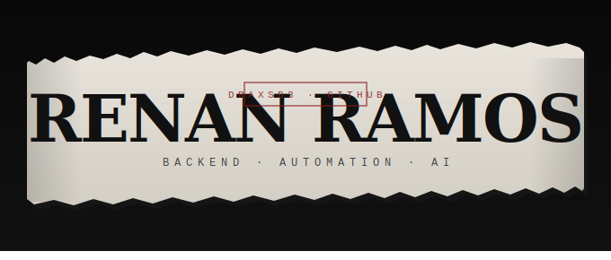

  

  
  
  
  
  
  
  

---

<h2 style="border-bottom: none; padding-bottom: 0;">Sobre mim</h2>

Desenvolvedor com foco em arquitetura backend, automação de processos e aplicações práticas de IA.
Atuo como Full Stack Software Engineer na Gold Credit Securitizadora, estruturando sistemas, automações e soluções internas com foco em eficiência operacional e escalabilidade.

<strong>Como penso sobre sistemas:</strong> cada decisão técnica tem uma razão. Não projeto só para o happy path — penso nas camadas, nas integrações e no que acontece quando algo falha.

Fundador da <strong>StreetLabs</strong>, startup de tecnologia em construção.

🎓 Desenvolvimento de Software — <strong>FATEC</strong>

---

<h2 style="border-bottom: none; padding-bottom: 0;">Foco no momento</h2>

<ul>
  <li>Construir sistemas com <strong>arquitetura que faz sentido para o problema</strong>, não só para funcionar.</li>
  <li>Aprofundar <strong>automação com IA</strong> — fluxos com n8n, integrações com modelos de linguagem e orquestração de processos reais.</li>
  <li>Desenvolver produtos próprios pela <strong>StreetLabs</strong> com visão de produto e organização de produção.</li>
</ul>

  

---

<h2 style="border-bottom: none; padding-bottom: 0;">Projetos em destaque</h2>

  

Sistema completo com backend em Laravel e frontend em React. Múltiplos perfis (admin, professor, aluno, responsável), módulo financeiro integrado ao acadêmico, controle de permissões via Sanctum e geração de documentos. Estruturado para escalar, não só para funcionar.

  

CRM para gestão de leads e pipeline comercial com Node.js + Express e React. Arquitetura em camadas, pipeline visual com drag and drop, autenticação JWT com controle por papel e consulta de CNPJ com fallback automático entre BrasilAPI e ReceitaWS.

  

API de envio de e-mails com Node.js. Simples, funcional e direto ao ponto.

---

  <table border="0" cellspacing="0" cellpadding="0" style="border: none; border-collapse: collapse;">
    <tr>
      <td align="center" valign="top" style="border: none; padding: 0 8px 0 0;">
        
      </td>
      <td align="center" valign="top" style="border: none; padding: 0 0 0 8px;">
        
      </td>
      <td align="center" valign="top" style="border: none; padding: 0 0 0 8px;">
        
      </td>
    </tr>
  </table>

---

<h2 style="border-bottom: none; padding-bottom: 0;">Stack e ferramentas</h2>

Uso **`Laravel / PHP`** e **`Node.js`** no backend, **`React`** no frontend. **`MySQL`** e **`MongoDB`** dependendo do domínio. **`n8n`** para automação de fluxos e integrações com IA. **`Git`** com commits descritivos e **`Docker`** quando o ambiente precisa ser replicável.

  
  
  
  
  
  
  
  
  
  
  
  

---

## Automação & IA

  <code>⚡ Trigger</code>
  &nbsp;→&nbsp;
  <code>🔁 Workflow</code>
  &nbsp;→&nbsp;
  <code>🔌 API / Data</code>
  &nbsp;→&nbsp;
  <code>🧠 Claude</code>
  &nbsp;→&nbsp;
  <code>📊 Decision</code>
  &nbsp;→&nbsp;
  <code>🚀 Action</code>

  Entrada inteligente → processamento automatizado → resposta operacional

---

## Aprendizado e contato

Sigo construindo pela **StreetLabs** e testando ideias nos repositórios acima. Se algo aqui te parecer útil ou quiser trocar ideia, é só chamar.

  

  
  

