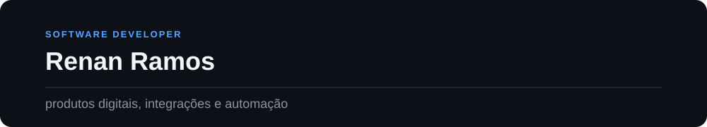

  

  <a href="https://www.linkedin.com/in/renan-ramos">LinkedIn</a>
  ·
  <a href="https://github.com/Draxsd3">GitHub</a>

## Sobre mim

Sou o Renan, desenvolvedor de software. Gosto de transformar problemas em produtos digitais simples, úteis e bem construídos.

Meu foco está em desenvolvimento full stack, integrações, automação e IA aplicada. Também desenvolvo projetos próprios pela **StreetLabs**.

## Tecnologias

`Laravel` · `PHP` · `Node.js` · `React` · `TypeScript` · `MySQL` · `MongoDB` · `n8n` · `Docker`

## Projetos

| Projeto | Descrição | Stack |
| --- | --- | --- |
| [Gestão Escolar](https://github.com/Draxsd3/gestao-escolar-fullstack) | Plataforma acadêmica com controle de perfis, financeiro e documentos. | Laravel · React |
| [CRM Full-Stack](https://github.com/Draxsd3/CRM-FullStack) | Gestão de leads e pipeline comercial com autenticação e integração de dados. | Node.js · Express · React |
| [API Email](https://github.com/Draxsd3/api-email) | API para integrar envio de e-mails a aplicações e automações. | Node.js |

## Atualmente

Construindo aplicações de ponta a ponta e explorando automações que tornem processos mais claros e eficientes.

  

  <i>Construindo, aprendendo e compartilhando uma entrega por vez.</i>

