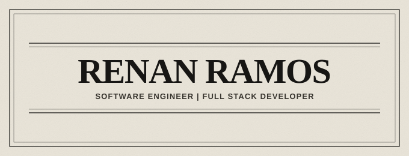

  

  
  

## Olá, eu sou o Renan 👋

Sou **Full Stack Software Engineer** na Gold Credit Securitizadora e fundador da **StreetLabs**. Construo sistemas e automações que resolvem problemas reais — com foco em arquitetura bem pensada, integrações confiáveis e operação escalável.

- 🧩 Backend, APIs e arquitetura de aplicações
- ⚡ Automação de processos e integrações com IA
- 🚀 Produtos próprios e soluções internas orientadas a resultado
- 🎓 Desenvolvimento de Software — **FATEC**

## Stack principal

  
  
  
  
  
  
  
  

## Projetos em destaque

| Projeto | O que resolve | Tecnologias |
| --- | --- | --- |
| [Gestão Escolar](https://github.com/Draxsd3/gestao-escolar-fullstack) | Plataforma acadêmica com múltiplos perfis, financeiro integrado, permissões e documentos. | Laravel, React, Sanctum |
| [CRM Full-Stack](https://github.com/Draxsd3/CRM-FullStack) | Gestão de leads e pipeline comercial, com autenticação por papel e consulta de CNPJ. | Node.js, Express, React |
| [API Email](https://github.com/Draxsd3/api-email) | API enxuta para envio de e-mails, pensada para integração simples e confiável. | Node.js |

## Como trabalho

> A tecnologia deve servir ao problema. Por isso, penso além do happy path: regras de negócio, integrações, falhas possíveis e manutenção fazem parte do desenho desde o início.

**Automação & IA:** `Trigger → Workflow → API/Dados → Modelo de IA → Decisão → Ação`

  

  Vamos trocar uma ideia sobre produto, automação ou engenharia de software? 
  <a href="https://www.linkedin.com/in/renan-ramos">LinkedIn</a> · <a href="https://github.com/Draxsd3">GitHub</a>

