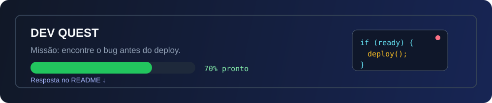

<p align="center">
  
</p>

<p align="center">
  <a href="https://www.linkedin.com/in/renan-ramos">
    
  </a>
  <a href="https://github.com/Draxsd3">
    
  </a>
  
</p>

## Olá, eu sou o Renan 👋

Sou desenvolvedor de software e gosto de transformar ideias em produtos digitais úteis. Entre uma interface, uma API e uma automação, meu objetivo é sempre o mesmo: **resolver problemas reais com experiências simples e tecnologia bem aplicada**.

Construo projetos full stack, exploro IA aplicada e automações, e desenvolvo produtos autorais pela **StreetLabs**.

<table>
  <tr>
    <td width="50%" valign="top">

### O que eu construo

- Aplicações web de ponta a ponta
- APIs, integrações e regras de negócio
- Automações que eliminam trabalho repetitivo
- Produtos digitais com intenção e utilidade

    </td>
    <td width="50%" valign="top">

### Meu jeito de trabalhar

- Começo pelo problema, não pela ferramenta
- Equilibro simplicidade e escala
- Valorizo detalhe, clareza e boa experiência
- Aprendo construindo e publico o que faz sentido

    </td>
  </tr>
</table>

## Toolbox

<p align="center">
  
</p>

<p align="center">
  <code>Laravel</code> · <code>Node.js</code> · <code>React</code> · <code>TypeScript</code> · <code>MySQL</code> · <code>MongoDB</code> · <code>n8n</code> · <code>Docker</code>
</p>

## Projetos em destaque

<table>
  <tr>
    <td width="33%" valign="top">

### 🎓 [Gestão Escolar](https://github.com/Draxsd3/gestao-escolar-fullstack)

Uma plataforma acadêmica com múltiplos perfis, financeiro integrado, permissões e documentos.

`Laravel` `React` `Sanctum`

    </td>
    <td width="33%" valign="top">

### 📈 [CRM Full-Stack](https://github.com/Draxsd3/CRM-FullStack)

CRM para organizar leads e pipeline comercial, com autenticação por papel e consulta de CNPJ.

`Node.js` `Express` `React`

    </td>
    <td width="33%" valign="top">

### ✉️ [API Email](https://github.com/Draxsd3/api-email)

Uma API prática para conectar envio de e-mails a aplicações e automações.

`Node.js` `API`

    </td>
  </tr>
</table>

## Dev Quest 🎮

<p align="center">
  
</p>

<details>
  <summary><b>🕹️ Jogar: qual é o bug?</b></summary>
  <br />

O código está quase pronto. Antes de liberar o deploy, encontre o detalhe que pode quebrar a missão:

```js
const deploy = async () => {
  const checks = await runChecks();

  if (checks.passed) {
    publish();
  }

  notifyTeam("Deploy concluído!");
};
```

<details>
  <summary>Ver resposta</summary>
  <br />

`publish()` não é aguardado. A mensagem pode ser enviada antes de o deploy terminar — ou até mesmo quando ele falhar. Uma versão mais segura seria:

```js
if (!checks.passed) throw new Error("Checks não passaram");
await publish();
notifyTeam("Deploy concluído!");
```
</details>
</details>

## Atividade

<p align="center">
  
  
</p>

<p align="center">
  
</p>

---

<p align="center">
  <i>Construindo, aprendendo e colocando ideias no mundo — uma entrega por vez.</i><br /><br />
  <a href="https://www.linkedin.com/in/renan-ramos">Vamos conversar?</a>
</p>
